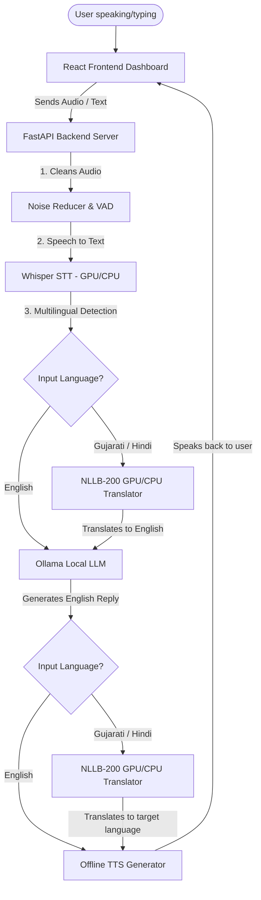

# Vaani 🎙

Vaani is an offline-first, private voice assistant that runs completely local on your computer. You can speak to it in **Hindi, Gujarati, or English**. Vaani:
1. Filters out background noise and static from your mic.
2. Transcribes your speech to text using `faster-whisper`.
3. Detects the input language and translates it (Hindi/Gujarati) to English using Meta's `NLLB-200`.
4. Queries a local Large Language Model (via Ollama).
5. Translates the LLM's English response back to your spoken input language (e.g. Hindi or Gujarati).
6. Synthesizes and speaks the response back to you offline.

No API keys, no internet connection required, and your voice data never leaves your computer.

---

## Key Features
- **GPU-Accelerated Processing:** Supports NVIDIA CUDA GPU execution for both STT (`faster-whisper` medium model) and Translation (`NLLB-200` distilled 600M) with automatic Windows CUDA DLL directory loading and robust CPU fallbacks.
- **Multilingual Support:** Converses back in the **same language** as your input (Hindi, Gujarati, or English).
- **Interactive Tour Guide:** Built-in guided onboarding flow to help users navigate features, controls, and connection statuses on first load.
- **Advanced Audio Processing:** WebRTC Voice Activity Detection (`webrtcvad`) and `noisereduce` to clean mic static and trigger smart auto-stop on speech pause.
- **Modern Web Interface:** Premium, reactive React + Vite frontend dashboard alongside a high-performance FastAPI backend API server.

---

## System Architecture



---

## Getting Started

### Prerequisites
- **Python:** version 3.10 to 3.13.
- **Node.js:** version 18 or higher (for the frontend React UI).
- **Ollama:** Download and run [Ollama](https://ollama.com/).
- **NVIDIA GPU (Optional but recommended):** For GPU-accelerated fast translations.

---

### Setup Instructions

#### 1. Backend Setup
Clone the repository and navigate to the project directory:

```bash
# Create and activate a virtual environment
python -m venv venv
.\venv\Scripts\activate      # On Windows PowerShell
# source venv/bin/activate   # On Linux/macOS

# Install backend python dependencies
pip install -r requirements.txt

# Download model weights (Whisper Medium & NLLB-200 Distilled) locally
python download_models.py

# Pull the LLM model inside Ollama
ollama pull qwen2.5:1.5b
```

#### 2. GPU Acceleration Setup (Optional for NVIDIA GPUs)
If you have an NVIDIA GPU, install the required CUDA runtime packages to your local user python environment so Vaani can load them:

```bash
pip install --user nvidia-cublas-cu12 nvidia-cudnn-cu12 nvidia-cuda-nvrtc-cu12
```
*Note: Vaani dynamically resolves and configures Windows environment PATH variables for these DLL libraries on startup. If loading fails, it automatically falls back to CPU.*

#### 3. Frontend Setup
Navigate to the UI folder and install Node.js dependencies:

```bash
cd vaani-ui
npm install
```

---

## Running the Application

Ensure **Ollama** is running in your taskbar, then open two separate terminals:

### Start the Backend Server (Terminal 1)
Run the FastAPI application from the project root:
```bash
python vaani_api.py
```
*The API server will run at `http://localhost:8001`.*

### Start the Frontend Dev Client (Terminal 2)
Run the Vite dev server from the `vaani-ui` directory:
```bash
cd vaani-ui
npm run dev
```
*The dashboard will be active at `http://localhost:5173/`.*

---

## Project Structure

```text
Vaani/
├── app/
│   ├── core/
│   │   ├── audio_capture.py       # Recording and silence detection
│   │   ├── audio_denoiser.py      # Noise reduction filter
│   │   ├── stt_engine.py          # faster-whisper STT loading & inference
│   │   ├── translation_engine.py  # NLLB-200 translation with CUDA GPU support
│   │   ├── response_generator.py  # Local Ollama streaming client
│   │   └── voice_synthesizer.py   # offline/online TTS synthesizer
│   ├── services/
│   │   └── pipeline.py            # Main workflow orchestrator
│   ├── api.py                     # FastAPI routes (/transcribe, /chat/stream, /tts)
│   └── config.py                  # Global settings, environment variables & CUDA DLL mapper
├── vaani-ui/
│   ├── src/
│   │   ├── components/            # Sidebar, ChatArea, MessageBubble & TourGuide UI components
│   │   ├── hooks/                 # Custom stream listeners
│   │   ├── App.jsx                # Core dashboard layout
│   │   └── index.css              # Glassmorphic and fluid custom CSS system
│   ├── package.json               # Frontend dependencies & scripts
│   └── vite.config.js             # Vite configuration
├── vaani_api.py                   # FastAPI dev server entrypoint
├── download_models.py             # Model weights downloader
├── requirements.txt               # Backend dependencies
└── README.md                      # Documentation
```

